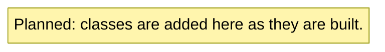

# Ledger

An offline personal finance tracker for Windows, written in Python.

Ledger lets you manage your personal finances on your own computer. You can create checking, savings and credit card accounts, record deposits, withdrawals and transfers, import transactions from a bank's CSV export, and view monthly statements and spending by category. All data is stored locally as JSON files, so Ledger needs no server, account or internet connection, and your data can't be lost to a service shutting down.

Ledger is the final project for CPTR212 Object Oriented Programming (fall 2026). Its code is organized to demonstrate each of the course's object-oriented programming topics; see [Course coverage](#course-coverage).

**Status:** in development (v0.1.0).

## Features

_Planned: a short list of what Ledger can do._

## Screenshots

_Planned: the main window, a monthly statement and the CSV import summary._

## Download and run

_Planned: how to download `Ledger.exe` from the v1.0.0 Release and run it, including a note on the Windows SmartScreen warning._

## Run from source

_Planned: how to clone the repository, install it and launch the app with `python -m ledger`._

## Run the tests

_Planned: how to run the `unittest` suite._

## Build the Windows executable

_Planned: how to build `Ledger.exe` with PyInstaller._

## Project structure

_Planned: what each package and module is responsible for._

## Class diagram

## Course coverage

_Planned: a table mapping each CPTR212 topic to where it appears in the code. The working version is kept in [docs/course-coverage.md](docs/course-coverage.md)._

## Design notes

_Planned: the key design decisions, such as storing money as `Decimal`, the credit card sign convention, all-or-nothing transfers, atomic saves and where data is stored._

## Known limitations

_Planned: what Ledger does not do._

## License

MIT. See [LICENSE](LICENSE).
